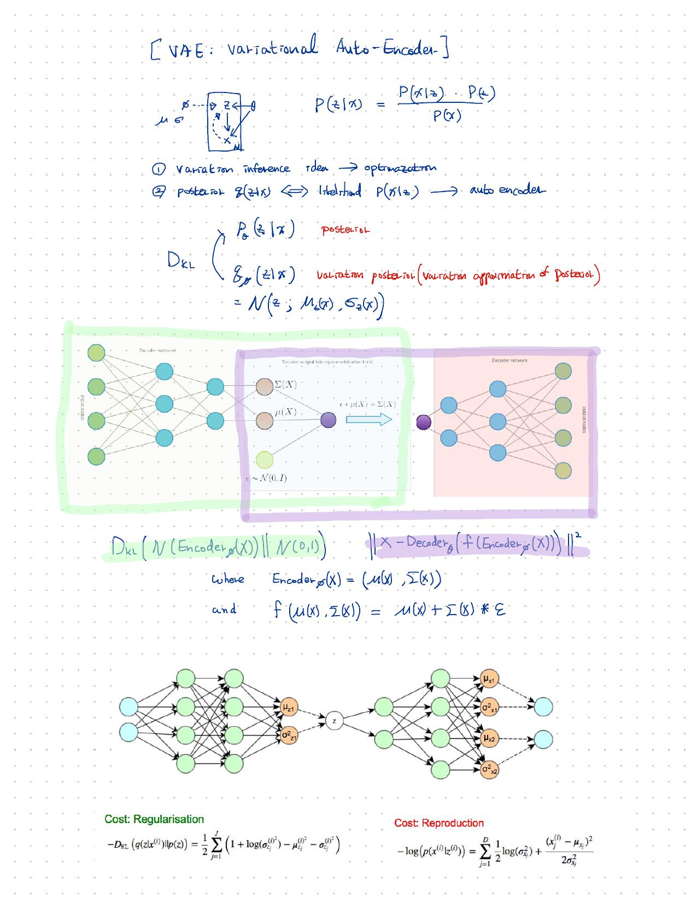
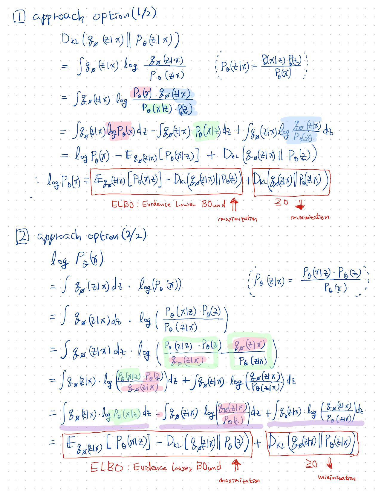
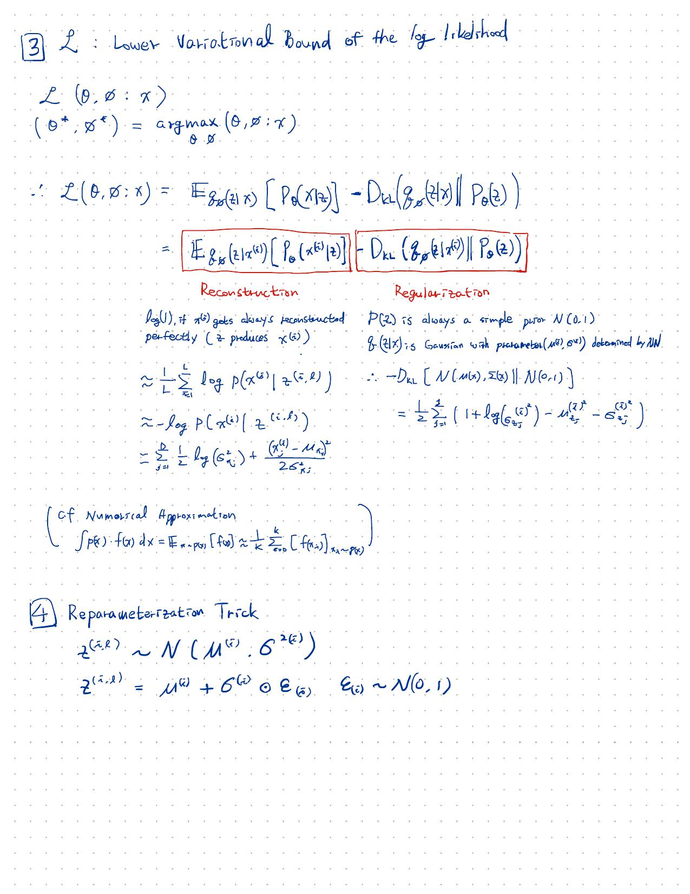

# Auto-Encoding Variational Bayes

### reference

[Variational Coin Toss](http://www.openias.org/variational-coin-toss)

[Variational Autoencoder: Intuition and Implementation](http://wiseodd.github.io/techblog/2016/12/10/variational-autoencoder/)

[Introduction to variational autoencoders](https://home.zhaw.ch/~dueo/bbs/files/vae.pdf)

[Variational Autoencoder in Tensorflow – facial expression low dimensional embedding](http://int8.io/variational-autoencoder-in-tensorflow/)

[JaejunYoo's blog](http://jaejunyoo.blogspot.com/2017/04/auto-encoding-variational-bayes-vae-1.html)